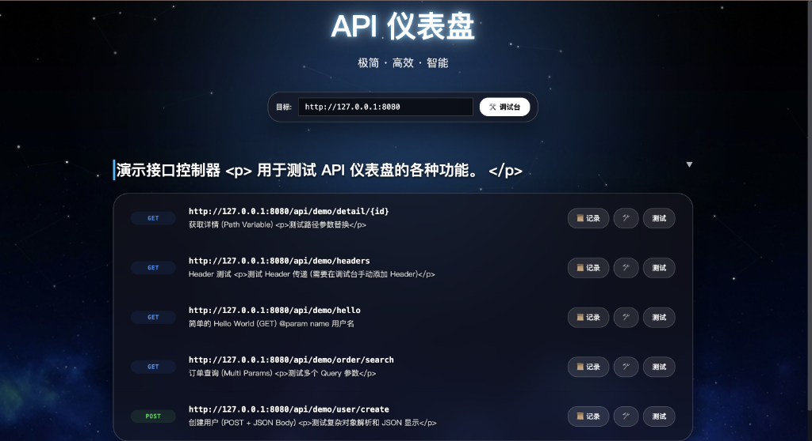

<div align="center">

# Sky Core ☁️ （天枢） 

**极简主义的 Spring Boot API 调试仪表盘**

[](https://central.sonatype.com/artifact/io.github.anranyunxiaomo/sky-core)
[](https://opensource.org/licenses/Apache-2.0)
[](https://github.com/anranyunxiaomo/sky-core/actions)

<p align="center">
  
</p>

</div>

---

## 📖 简介 | Introduction

**天枢 (Sky Core)**，取自北斗七星之首，意为众星之枢纽。

在古代星象学中，天枢星指引方向；在现代软件架构中，**Sky Core** 则是您 API 治理的罗盘。
作为 Spring Boot 应用的 **API 指挥中枢**，它以极简主义为核心设计理念，为您提供**零配置**、**高颜值**的接口调试体验。

面对日益复杂的接口调试需求，传统的 Swagger/OpenAPI 往往让代码充斥着臃肿的注解，喧宾夺主。天枢回归代码本质——**注释即文档**。它深入解析源码层面的 JavaDoc，将其转化为优雅的交互界面，让开发者从文档维护的泥潭中解脱，专注于业务逻辑的星辰大海。

无需任何额外注解，仅需一行代码，即可让您的 API 如星辰般清晰呈现。

### ✨ 核心特性

- **🍎 极致 UI 设计**: 采用毛玻璃 (Glassmorphism) 与卡片式布局，赏心悦目。
- **📝 零侵入文档**: 无需 `@ApiOperation` 等任何注解，**直接读取 Java 注释**。
- **⚡️ 智能调试**: 自动解析参数结构，一键生成 JSON 模板，支持复杂对象递归。
- **🔌 即插即用**: 引入依赖 -> 加注解 -> 启动，三步完成配置。

---

## 🎨 界面交互 | Interface & Interaction

Sky Core 打造了沉浸式的 API 调试环境，每一个像素都经过精心雕琢：

- **星辰深色模式**: 默认采用深邃的星空背景，搭配磨砂玻璃质感的卡片容器，有效缓解长时间开发的视觉疲劳。
- **智能调试台**: 
  - **动态参数生成**: 根据 Java 对象结构自动生成 JSON 请求体模板。
  - **实时响应预览**: 支持 JSON 高亮、折叠，状态码一目了然。
- **极速响应**: 单页应用 (SPA) 架构，无刷新切换接口，操作如丝般顺滑。
  
> "好的工具应该是隐形的，让您感觉不到它的存在，却又无处不在地辅助您。"

---

## 🚀 快速开始 | Quick Start

### 1. 引入依赖
在您的 `pom.xml` 中添加最新版本依赖：

```xml
<dependency>
    <groupId>io.github.anranyunxiaomo</groupId>
    <artifactId>sky-core</artifactId>
    <version>0.0.1</version>
</dependency>
```

### 2. 开启功能
在 Spring Boot 启动类上添加注解 **`@EnableApiDashboard`**：

```java
import com.sky.core.annotation.EnableApiDashboard;
import org.springframework.boot.SpringApplication;
import org.springframework.boot.autoconfigure.SpringBootApplication;

@SpringBootApplication
@EnableApiDashboard // <--- 关键一步
public class MyApplication {
    public static void main(String[] args) {
        SpringApplication.run(MyApplication.class, args);
    }
}
```

### 3. 开始使用
启动项目，访问：
👉 **`http://localhost:8080/api-dashboard`**

---

## � 编写文档 | Writing Docs

**忘记那些繁琐的注解吧！** Sky Core 能够理解您的代码和注释。

```java
/**
 * 📦 商品管理模块
 * (类上的注释将成为左侧菜单的分组名称)
 */
@RestController
@RequestMapping("/products")
public class ProductController {

    private final ProductService service;

    /**
     * 🔍 根据ID查询商品详情
     * (方法上的注释将成为接口描述)
     */
    @GetMapping("/{id}")
    public Result<ProductDTO> getDetail(@PathVariable Long id) {
        return service.findById(id);
    }

    /**
     * ✨ 创建新商品
     * 支持复杂参数结构解析
     */
    @PostMapping("/create")
    public Result<Long> create(@RequestBody ProductCreateRequest request) {
        return service.create(request);
    }
}
```

> **提示**: 修改代码或注释后，重启项目（或使用热部署）刷新页面即可看到更新。

---

## 🛠 开发与构建 | Development

如果您想参与本项目开发或本地构建：

```bash
git clone https://github.com/anranyunxiaomo/sky-core.git
cd sky-core
mvn clean install
```

## 📄 许可证 | License

本项目采用 [Apache 2.0 许可证](LICENSE)。
